# P1 Onboarding Demo — Studio 5000 and FactoryTalk View SE Setup

End-to-end setup for someone who has cloned this repository and has no prior
context: how to get the two PLC projects into Studio 5000, connect FactoryTalk
View SE to the testbed PLCs, load the HMI displays, and run the demo.

**Two paths are described:**

- **[Path A — run the shipped demo](#path-a--run-the-shipped-demo)** (most
  people want this): import the display exports in this repository and run them.
  Requires exact shortcut names.
- **[Path B — build a display from scratch](#path-b--build-a-display-from-scratch)**:
  create your own HMI application and wire a button to a PLC tag. Useful for
  learning how the tag binding works before touching the shipped displays.

Both paths share [Part 1](#part-1--import-the-plc-projects) and
[Part 2](#part-2--connect-factorytalk-to-the-plcs).

---

## Prerequisites

| Requirement | Version / value | Source |
|---|---|---|
| Studio 5000 Logix Designer | v37 or later | `SoftwareRevision="37.00"` in both L5X files |
| Controller platform | ControlLogix **1756-L72** (LOGIX5572) | `ProcessorType` in L5X; confirmed in the FactoryTalk browse tree |
| FactoryTalk View SE | **v16**, Site Edition (Local Station) | displays declare `Gfx-SE16.xsd` |
| FactoryTalk Linx | Bundled with SE | provides the device shortcuts |

You also need access to the Windows VM on the SPHERE testbed that hosts Studio
5000 and FactoryTalk View. Activating the experiment and configuring your SSH
config is covered by the testbed onboarding procedure, not by this document —
see the SPHERE enclave setup material.

> **Gap:** the testbed activation/SSH steps currently live outside this
> repository. Until they are captured here or in `sphere-docs`, this document
> assumes you already have a working session on the HMI VM.

### The two controllers

The demo runs **two** controllers — one running the plant simulation, one
running the control logic — wired so each one's outputs are the other's inputs.

| Role | Controller name | Project files |
|---|---|---|
| Control logic | `Controller_PLC` | `implementations/rockwell/controller/Controller_PLC.L5X` / `.L5K` |
| Plant simulation | `Simulation_PLC` | `implementations/rockwell/simulator/Simulator_PLC.L5X` / `.L5K` |

> Note the asymmetry: the simulator's *file* is named `Simulator_PLC` but the
> *controller inside it* is named `Simulation_PLC`. Both names appear during setup.

### L5X vs L5K — which to use

Both formats contain the same logic; they are alternate export formats, not
different programs.

- **`.L5X` (XML)** — use this for import. Standard Studio 5000 import/export
  format, and what the steps below assume.
- **`.L5K` (ASCII)** — text format, kept for diff and review in pull requests.
  Importable, but no reason to prefer it here.

---

## Part 1 — Import the PLC projects

Repeat for **both** projects (controller and simulator).

1. Open **Studio 5000 Logix Designer**.
2. **File → Open**, set the file-type filter to `Logix Designer XML Files (*.L5X)`.
3. Select `Controller_PLC.L5X` (or `Simulator_PLC.L5X`).
4. Studio 5000 converts the L5X into a new `.ACD` project. Save it somewhere
   outside this repository — **do not commit `.ACD` files**; the L5X exports are
   the version-controlled source of truth.
5. **Who Active** → select the target chassis and slot for this controller.
6. **Download** the project to the controller and put it in **Run** mode.

Import and download the **simulator first**, then the controller — the
controller reacts to values the simulator produces.

If you make changes, export back to L5X (**File → Save As → L5X**) and commit
that file. The `.ACD` is a local build artifact.

---

## Part 2 — Connect FactoryTalk to the PLCs

### 2.1 Launch FactoryTalk View and create/open an application

1. On the HMI VM, launch **FactoryTalk View**.

   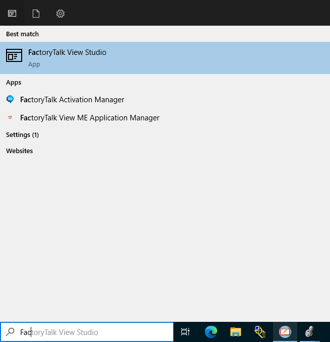

2. When prompted for an edition, choose **View Site Edition (Local Station)**.

   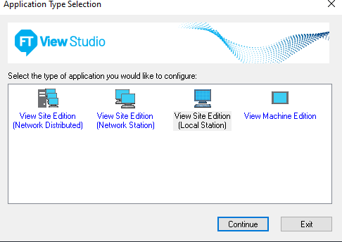

3. On the **New / Open Site Edition (Local Station) Application** dialog, either
   open an existing application or switch to the **New** tab and give yours a
   name you will remember.

   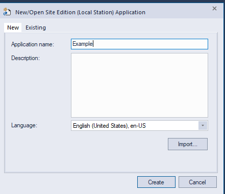

4. Wait for the environment to finish loading — this can take a minute.

   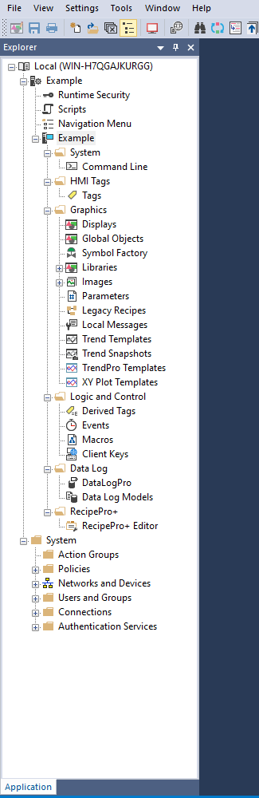

### 2.2 Add the device server

5. Right-click your application name in the Explorer tree and choose
   **Add New Server → Rockwell Automation Device Server (FactoryTalk Linx)**.
   Confirm the dialog.

   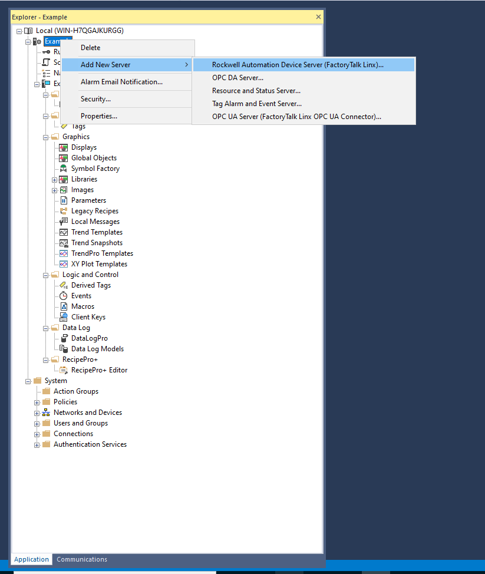

6. A **FactoryTalk Linx** node appears in the tree. Open its
   **Communication Setup**.

   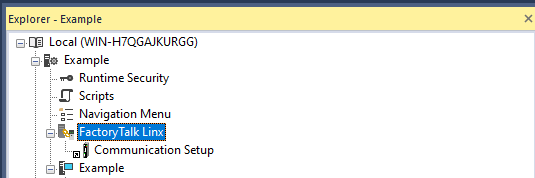

### 2.3 Browse to the controllers

7. Select the **EtherNet, Ethernet** driver.

   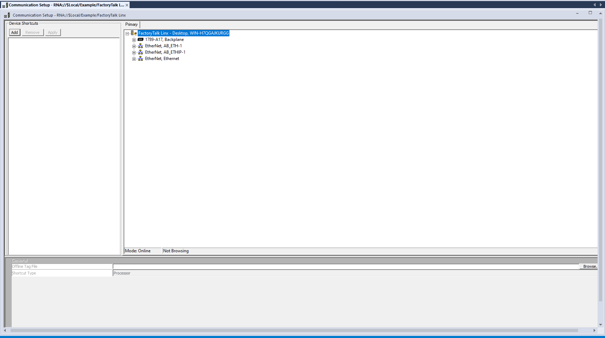

8. The tree shows the testbed devices — the two PLC chassis and the physical
   panel HMI.

   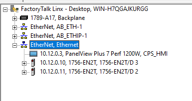

   | Address | Device |
   |---|---|
   | `10.12.0.10` | Controller PLC chassis (1756-EN2T/D) |
   | `10.12.0.11` | Simulator PLC chassis (1756-EN2T/D) |
   | `10.12.0.3` | PanelView Plus 7 Perf 1200W (`CPS_HMI`) — physical panel |

   > **Verify addressing before relying on it.** The repository's
   > `implementations/rockwell/hw_test_config.yaml` records the controller and
   > simulator as `10.100.0.10` / `10.100.0.11`, while the FactoryTalk browse
   > tree above shows `10.12.0.10` / `10.12.0.11`. These may be different
   > network segments or the addressing may have changed. Confirm against the
   > live testbed and correct whichever is stale.

9. Expand the controller chassis (`10.12.0.10`) → **Backplane, 1756-A13/C**, and
   select the processor in **slot 0**: `1756-L72 / LOGIX5572`.

   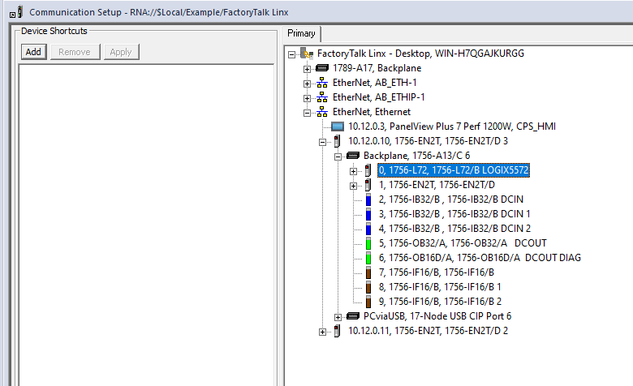

   For reference, the controller chassis is populated as: slot 0 processor,
   slot 1 `1756-EN2T`, slots 2–4 `1756-IB32/B` digital in, slot 5 `1756-OB32/A`
   digital out, slot 6 `1756-OB16D/A` diagnostic digital out, slots 7–9
   `1756-IF16/B` analog in.

### 2.4 Create the device shortcuts — names matter

10. With the processor still highlighted, click **Add** under **Device
    Shortcuts**, name the shortcut, and click **Apply**. The shortcut must stay
    highlighted for **Apply** to enable.

    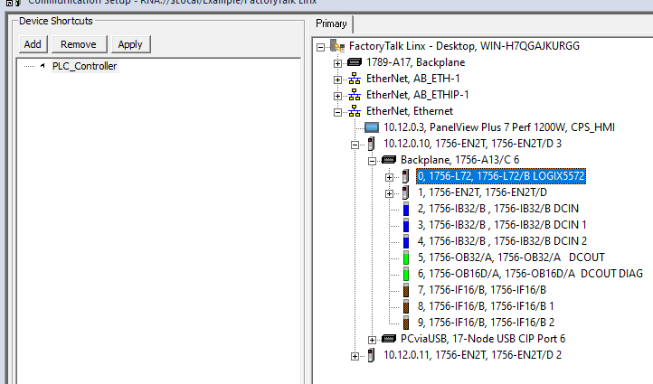

11. Repeat for the simulator chassis (`10.12.0.11`).

> ### ⚠️ Use these exact shortcut names for the shipped displays
>
> The display exports in this repository do **not** embed controller addresses.
> They bind through two named shortcuts, and the names must match **exactly**,
> including case:
>
> | Shortcut name | Must point to |
> |---|---|
> | `HMI_Sphere` | the **`Controller_PLC`** processor (`10.12.0.10`, slot 0) |
> | `HMI_Simulator` | the **`Simulation_PLC`** processor (`10.12.0.11`, slot 0) |
>
> Any other name — `PLC_Controller`, `HMI_SPHERE`, `Controller` — and every
> animated object on both displays will fail to resolve its tags. If you are
> only following Path B to learn the workflow, the name is yours to choose; if
> you intend to import the shipped displays, use the names above.

12. Scroll the Communication Setup window to the **bottom right** to reach the
    **OK** button — it sits below the fold at most window sizes.

    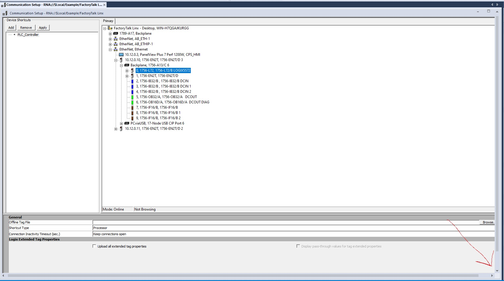

    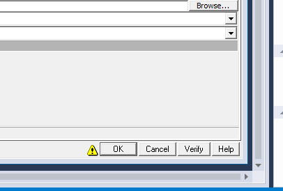

13. Click **OK**, then **Yes** on the confirmation prompt.

The shortcut type should read **Processor**, with **Keep connections open** as
the inactivity setting.

---

## Path A — Run the shipped demo

The displays live in `implementations/rockwell/hmi/`:

| File | Display | Purpose |
|---|---|---|
| `HMI_Start_Stop.xml` | **Main Display** | Operator controls, tank levels, valve/pump status |
| `Graph.xml` | **Graphs** | Tank levels trended over time |
| `BatchImport_PLC_V2.xml` | — | Batch manifest that imports both displays in one pass |

### Import the displays

**Batch (both at once):** right-click **Displays** in the Explorer tree →
**Import and Export** → **Import graphic information into displays** →
**Multiple displays batch import file** → select `BatchImport_PLC_V2.xml`.

`BatchImport_PLC_V2.xml` references the two display files **by bare filename**,
so keep all three in the same directory when importing.

**Individually:** run the same wizard once per display, choosing **Single
display import file** for `HMI_Start_Stop.xml`, then `Graph.xml`.

### Run

1. Confirm both controllers are downloaded and in **Run** mode.
2. Open **Main Display** and click **Run/Test Display** (the play button), or
   launch it from a FactoryTalk View SE Client.
3. Press **`Start_Sim`**, then **`Start_Cont`**.

| Button | Action |
|---|---|
| `Start_Sim` | Start the simulator PLC; process values begin updating |
| `Start_Cont` | Start the controller PLC; control logic begins executing |
| `Stop_Cont` | Stop the controller; state machine transitions to shutdown |
| `RST` | Reset the simulator, tank levels, valves, and process values |

The controller advances through `IDLE → START → RUNNING → SHUTDOWN`.

Expected behaviour: the P1 raw water tank fills to ~800 mm, the transfer valve
and pump open to move water into the P3 ultrafiltration tank, P3 fills to
1000 mm, drains for a random 5–8 s, and the cycle repeats. The Main Display has
a button that opens the **Graphs** display.

---

## Path B — Build a display from scratch

Useful for understanding how a display object binds to a PLC tag before working
with the shipped displays. This builds a single start button wired to one tag.

14. Create a display and add a button.

    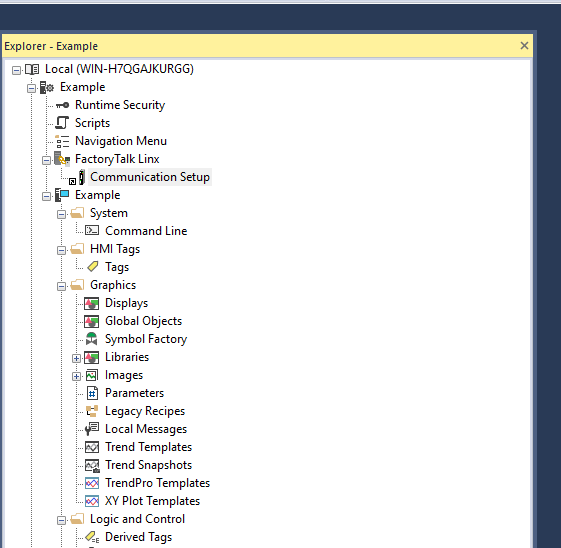

15. Click the button → **Button Properties** → the **Press action** field →
    the **…** ellipsis.

    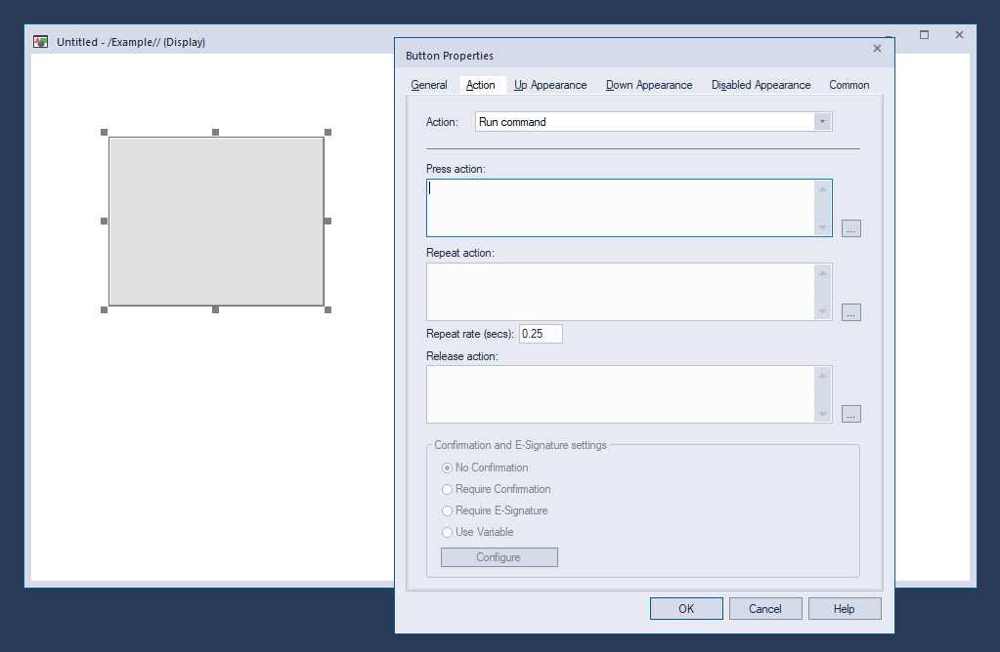

16. Navigate to **System → Tag database**, and choose **Set** or **Toggle**
    (Toggle is simpler for a start/stop button).

    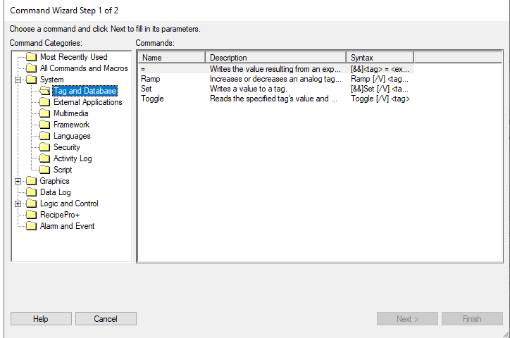

17. Choose **Toggle**, click **Next**, then the **…** ellipsis again.

    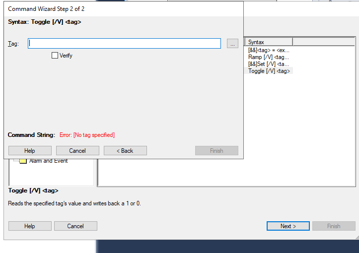

18. In the tag browser, the shortcut you created in Part 2 should be listed. If
    it is not, click the refresh button.

    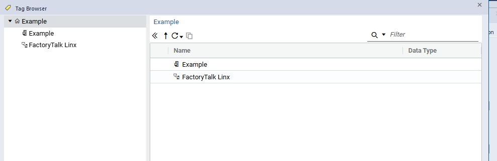

    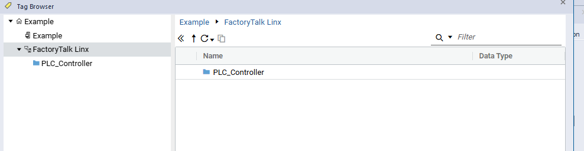

19. Expand the shortcut and select **Online** to browse every tag on that
    controller.

    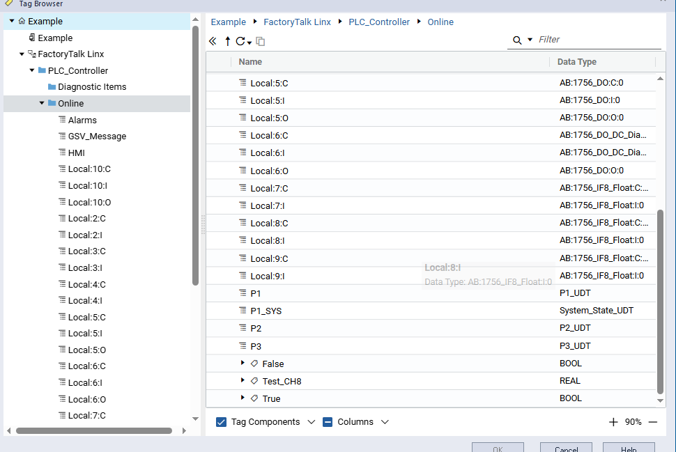

20. In Studio 5000, add a simple start/stop rung in `MainRoutine`. The input bit
    (for example `HMI.Start_PB`) is the tag to associate with the HMI button.

    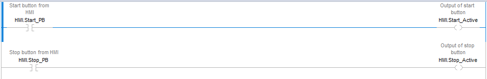

21. Back in FactoryTalk View, select that tag to bind it to the button.

    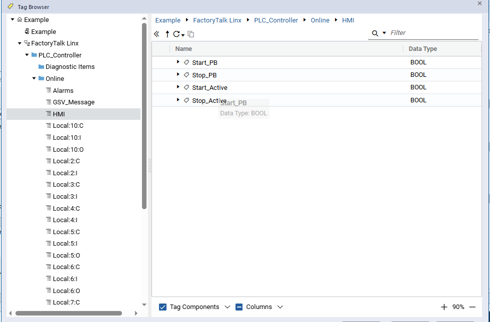

22. Confirm the selection, click **Finish**, then **OK** in Button Properties.

    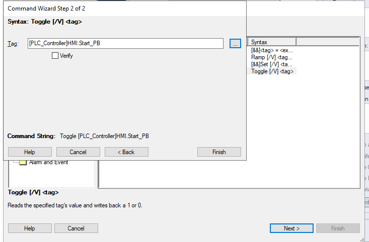

    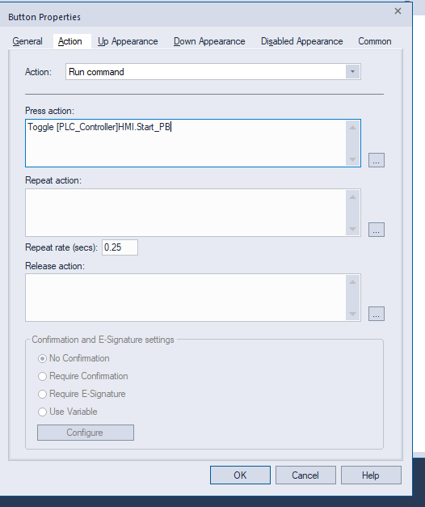

23. Click the play button to test the display, with the Studio 5000 project
    online. Use **Download** to the PLC — not Upload.

    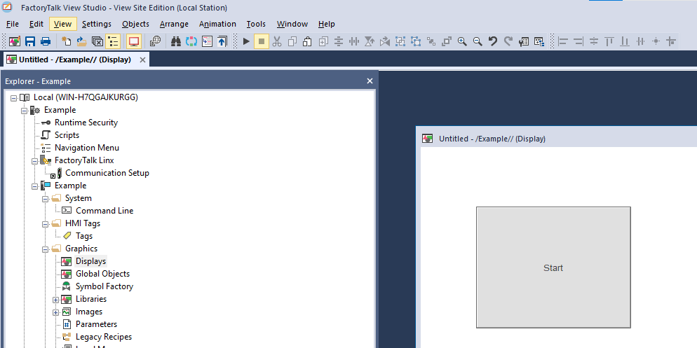

    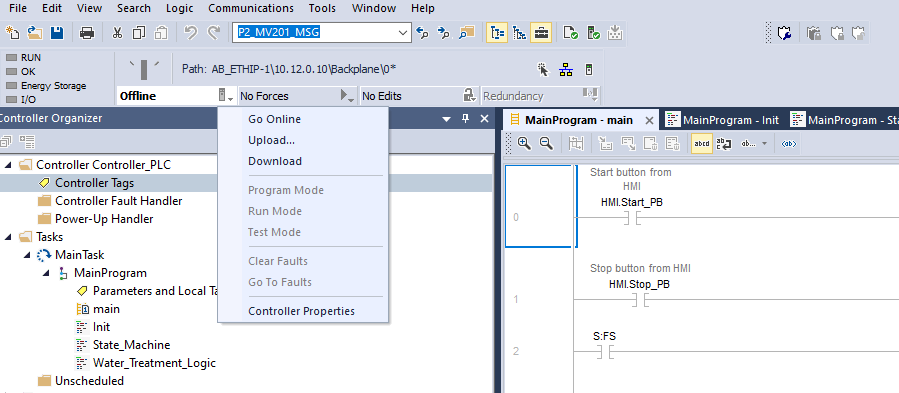

24. Pressing the button in FactoryTalk View should light the input bit and
    energize the output in Studio 5000.

    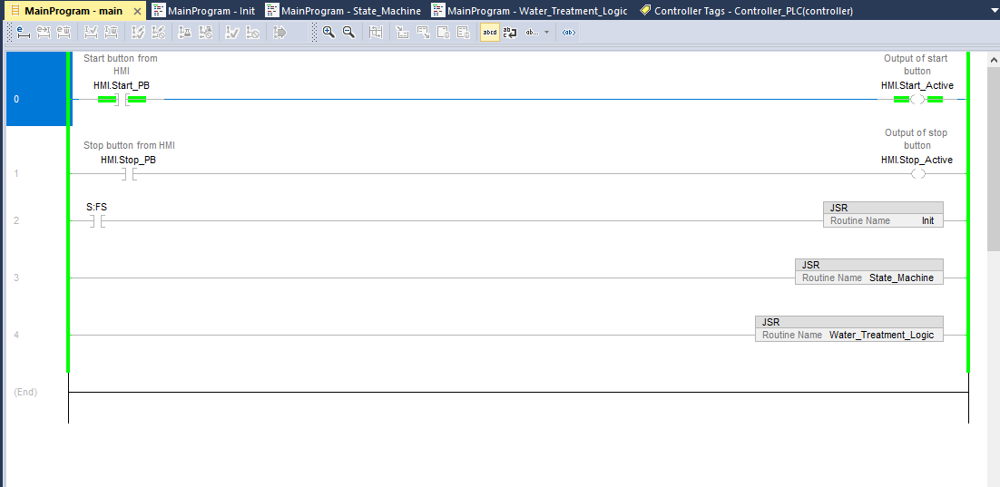

---

## Tag reference

Complete list of PLC tags the shipped displays bind to, extracted from the
display exports. All controller-side tags are verified present in
`Controller_PLC.L5X`, and both simulator-side tags in `Simulator_PLC.L5X`.

### Via the `HMI_Sphere` shortcut → `Controller_PLC`

| Tag | Meaning |
|---|---|
| `P1.RW_Tank_tnk_lvl` | P1 raw water tank level (mm) |
| `P1.RW_Pump_start` | Raw water transfer pump run command |
| `P1.RW_Tank_PR_Valve` | Raw water tank PR valve |
| `P1.RW_Tank_P_Valve` | Raw water tank P valve |
| `P3.Ultrafiltration_UFFT_Tank_tnk_lvl` | P3 ultrafiltration tank level (mm) |
| `P3.Ultrafiltration_UFFT_Tank_Valve_sts` | P3 tank valve status |
| `P1_SYS.IDLE` | State machine — idle |
| `P1_SYS.START` | State machine — starting |
| `P1_SYS.RUNNING` | State machine — running |
| `P1_SYS.SHUTDOWN` | State machine — shutting down |
| `HMI.Start_Active` | Controller start latched from HMI |
| `HMI.Stop_Active` | Controller stop latched from HMI |

### Via the `HMI_Simulator` shortcut → `Simulation_PLC`

| Tag | Type | Meaning |
|---|---|---|
| `Start_ACTIVE` | `BOOL` | Simulator running |
| `RST_ACTIVE` | `BOOL` | Simulator reset asserted |

These are structured tags built on user-defined types carried in the L5X
(`HMI_UDT`, `P1_UDT`, `P2_UDT`, `P3_UDT`, `Phases_UDT`, `System_State_UDT`,
`RW_tank_AL_UDT`, `SYS_MESSAGES`) — importing the L5X creates the UDTs, so no
separate tag database import is needed.

---

## Troubleshooting

**Every animated object shows errors, `####`, or fails to resolve tags.**
Almost always a shortcut-name mismatch. The names must be exactly `HMI_Sphere`
and `HMI_Simulator` — see the callout in Part 2.4.

**Some objects resolve, others do not.**
Likely one shortcut is configured and the other is not, or both point at the
same controller. They must target two *different* processors.

**The shortcut does not appear in the tag browser.**
Click the refresh button in the browser. If it still does not appear, the
shortcut was probably not applied — reopen Communication Setup and confirm it is
listed under **Device Shortcuts** with the processor still associated.

**Apply is greyed out when creating a shortcut.**
The processor must remain highlighted in the browse tree while the shortcut is
selected.

**Cannot find the OK button in Communication Setup.**
Scroll both the horizontal and vertical scrollbars to the bottom right; it sits
below the fold at most window sizes.

**Batch import cannot find the display files.**
`BatchImport_PLC_V2.xml` references `Graph.xml` and `HMI_Start_Stop.xml` by bare
filename. Keep all three in one directory, or import each display individually.

**Displays import but values never change.**
Check both controllers are in **Run** mode, not Program mode, and that
`Start_Sim` was pressed before `Start_Cont` — the controller has nothing to act
on until the simulator produces values.

**Tank levels move but the process never cycles.**
Confirm the controller project is the current export from this repository. The
scan-time based flow model depends on tags (`dt`, `Fill_rate`, `In_Flow_P3`,
`Out_Flow_P3`) that are not present in older exports of this demo.

---

## Related

- [`../README.md`](../README.md) — use case overview and quick start
- [`../implementations/rockwell/README.md`](../implementations/rockwell/README.md) — Rockwell file inventory and CrossPLC translation
- Known limitations of the demo are listed in the use case README
